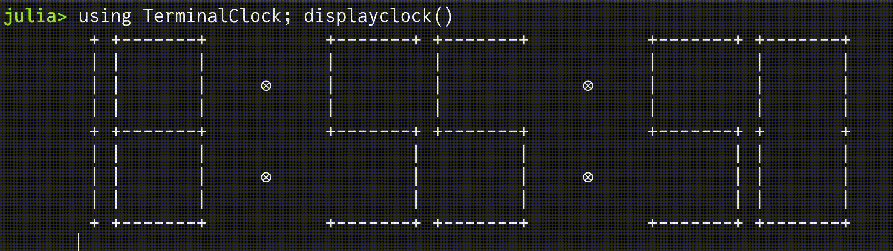

# TerminalClock.jl

Display Clock on your Terminal



# Usage

```julia
julia> using TerminalClock; displayclock() # Press Ctrl+C to quit
+-------+ +-------+           +-------+ +-------+           +-------+ +-------+
|       |         |                   |         |           |       |         |
|       |         |     ⊗             |         |     ⊗     |       |         |
|       |         |                   |         |           |       |         |
+       + +-------+           +-------+ +-------+           +       + +-------+
|       |         |                   |         |           |       |         |
|       |         |     ⊗             |         |     ⊗     |       |         |
|       |         |                   |         |           |       |         |
+-------+ +-------+           +-------+ +-------+           +-------+ +-------+
```
