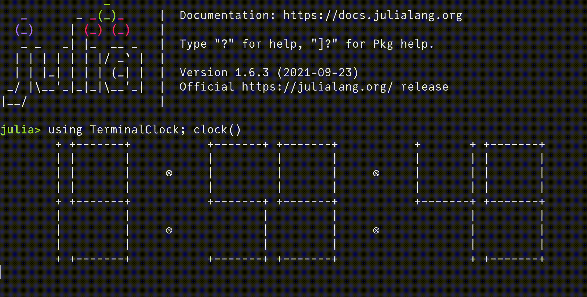
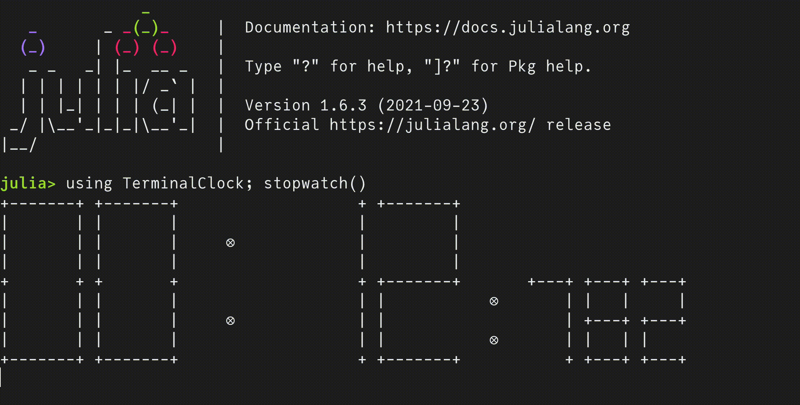

# TerminalClock.jl

[](https://github.com/AtelierArith/TerminalClock.jl/actions/workflows/CI.yml)

Display Clock on your Terminal





# Installation

```console
julia -e 'using Pkg; Pkg.add("TerminalClock")'
```

# Usage

## `clock()`

- Hey Julian! What time is it now ?

```julia
julia> using TerminalClock; clock() # Press Ctrl+C to quit
+-------+ +-------+           +-------+ +-------+           +-------+ +-------+
|       |         |                   |         |           |       |         |
|       |         |     ⊗             |         |     ⊗     |       |         |
|       |         |                   |         |           |       |         |
+       + +-------+           +-------+ +-------+           +       + +-------+
|       |         |                   |         |           |       |         |
|       |         |     ⊗             |         |     ⊗     |       |         |
|       |         |                   |         |           |       |         |
+-------+ +-------+           +-------+ +-------+           +-------+ +-------+
```

## `stopwatch()`

- On your mark, get set, go! 

```julia
julia> using TerminalClock; stopwatch() # Press Ctrl+C to quit
+-------+ +-------+           +-------+ +-------+
|       | |       |           |       |         |
|       | |       |     ⊗     |       |         |
|       | |       |           |       |         |
+       + +       +           +       + +-------+       +---+ +---+ +---+
|       | |       |           |       | |           ⊗   |     |   |     |
|       | |       |     ⊗     |       | |               +---+ +---+ +---+
|       | |       |           |       | |           ⊗       |     | |
+-------+ +-------+           +-------+ +-------+       +---+ +---+ +---+
```

## `countdown()`

- Would you like to try some Japanese instant noodles?

```julia
julia> using TerminalClock; countdown() # equivalent to `countdown(hour=0, minute=3, second=0)`
+-------+ +-------+           +-------+ +-------+           +-------+ +-------+
|       | |       |           |       |         |           |       | |       |
|       | |       |     ⊗     |       |         |     ⊗     |       | |       |
|       | |       |           |       |         |           |       | |       |
+       + +       +           +       + +-------+           +       + +       +
|       | |       |           |       |         |           |       | |       |
|       | |       |     ⊗     |       |         |     ⊗     |       | |       |
|       | |       |           |       |         |           |       | |       |
+-------+ +-------+           +-------+ +-------+           +-------+ +-------+
```

# Another option for dial?

1. Prepare "YourDials.toml" e.g. [src/dials/UnicodeBox.toml](./src/dials/UnicodeBox.toml).
  - See also [Issue 16](https://github.com/AtelierArith/TerminalClock.jl/issues/16).
2. After that do the following command on your Julia REPL:

```console
julia> using TerminalClock
julia> tomlfile = joinpath(dirname(pathof(TerminalClock)), "dials", "UnicodeBox.toml");
julia> TerminalClock.set_dials("/path/to/YourDials.toml")
[ Info: New dials set; restart your Julia session for this change to take effect!
```

For example:

```console
$ julia --quiet
julia> using TerminalClock
julia> tomlfile = joinpath(dirname(pathof(TerminalClock)), "dials", "UnicodeBox.toml");
julia> TerminalClock.set_dials(tomlfile)
[ Info: New dials set; restart your Julia session for this change to take effect!
julia> exit() # please restart julia
$ julia --quiet
julia> using TerminalClock, Dates
julia> dt = DateTime(2021, 11, 15, 12, 34, 56, 7);
julia> print(clock(dt))
    ░█     ░█████░             ░██████       ░██             ███████    █████  
   ███     ██   ██░    ▒█▒     ██   ███     ████     ▒█▒     ██        ██   ██ 
    ██          ██     ███           ██    ██ ██     ███    ▒██        ██      
    ██         ██      ▒█▒          ░█░   ██  ██     ▒█▒    ██        ██       
    ██        ██                 █████   ██   ██            ████████░ ████████ 
    ██       ██        ▒█▒          ░█░ ██    ██     ▒█▒           ██ ██     ██
    ██      ██         ███           ██ █████████    ███           ██ █       █
    ██     ██░         ▒█▒     ██    ██       ██     ▒█▒    ██     ██ ███   ███
   ████    ███████             ░██████        ██             ███████░   █████
julia> TerminalClock.clear_dials() # you can clear preferences from `YourDials`.
[ Info: Dials cleared; restart your Julia session for this change to take effect!
julia> exit()
$ julia --quiet
julia> using TerminalClock, Dates
julia> dt = DateTime(2021, 11, 15, 12, 34, 56, 7);
julia> print(clock(dt))
        + +-------+           +-------+ +       +           +-------+ +-------+
        |         |                   | |       |           |         |
        |         |     ⊗             | |       |     ⊗     |         |
        |         |                   | |       |           |         |
        + +-------+           +-------+ +-------+           +-------+ +-------+
        | |                           |         |                   | |       |
        | |             ⊗             |         |     ⊗             | |       |
        | |                           |         |                   | |       |
        + +-------+           +-------+         +           +-------+ +-------+
```
